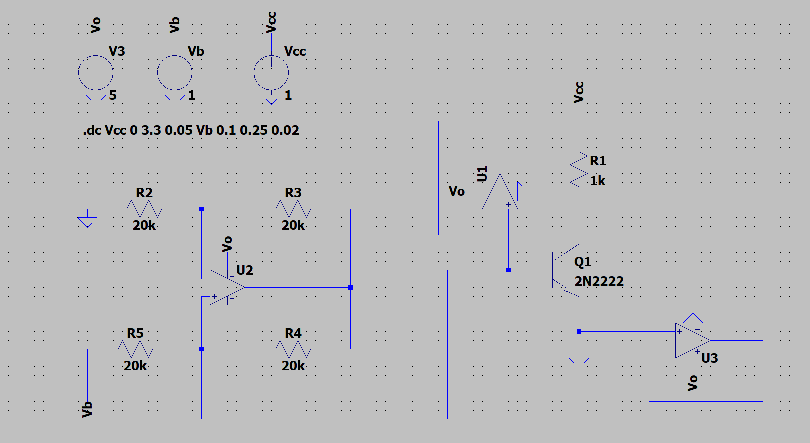
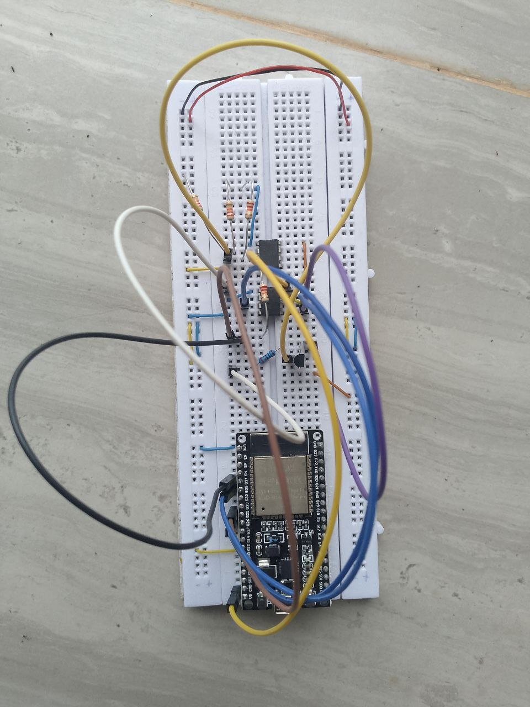

# BJT Curve Tracer (Breadboard Prototype v1)

## Overview

This repository shows a low-cost, automated BJT curve tracer built with ESP32-DevKit-C. This system uses a Howland Current Pump to step base current ($I_B$) and an ADC feedback loop to capture true hardware voltage, bypassing microcontroller DAC non-linearities and inaccuracies. The resulting processed and raw data is logged serially and plotted via GNU Octave.

## Hardware Architecture
* **Controller:** ESP32-DevKit-C
* **Current Source:** LM358 Op-Amp configured as a Howland Current Pump ($R_{pump} = 20k\Omega$)
* **Device Under Test (DUT):** 2N2222 NPN BJT
* **Collector Load:** $1k\Omega$ sensing/collector resistor

## Known System Constraints & Physical Realities
1. **ESP32 DAC Deadzone:** The internal 8-bit DAC exhibits severe non-linearity near ground. To calculate accurate base currents at the micro-amp level, the Howland pump's driving voltage is actively measured via a dedicated ADC feedback loop rather than relying on idealized mathematical output.
2. **Low-Current Beta Roll-off:** At micro-amp base drives ($I_B < 20\mu A$), the 2N2222 exhibits significant $\beta$ degradation, which is accurately mapped by the ADC feedback.
3. **Load-Line Saturation:** Operating the collector sweep on a 5V/3.3V rail with a $1k\Omega$ current-sensing resistor creates a hard physical $V_{CE}$ saturation wall at roughly 3.3mA. 

## Next Steps (v2 Architecture)
* To be determined